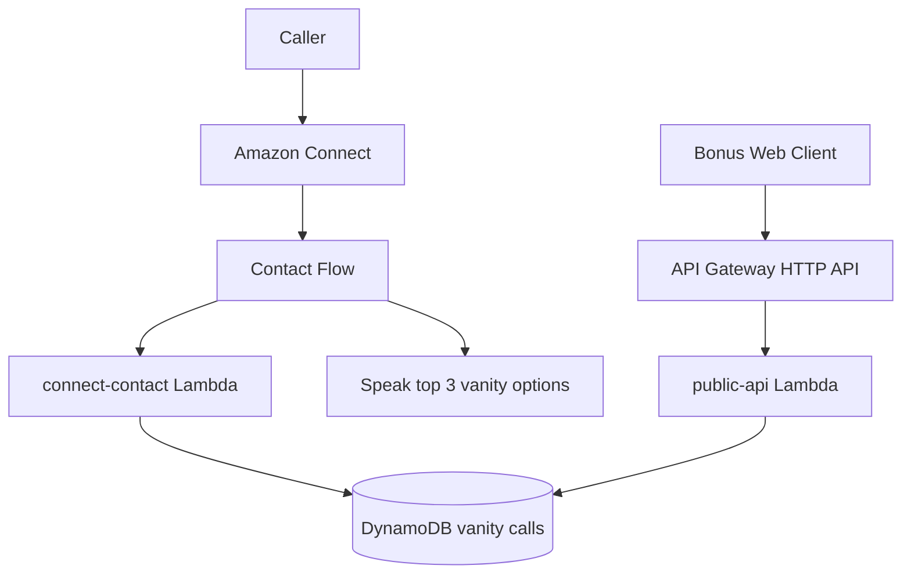

# Connect Vanity Number Project (TypeScript + Terraform)

This repo implements the assignment as a TypeScript monorepo with Terraform infrastructure.

## What is deployed

### `infra/stacks/connect-vanity` (core)
- DynamoDB table storing caller + top 5 vanity numbers
- Shared API Gateway HTTP API

### `infra/stacks/lambda-services` (dynamic Lambda deploy)
- Deploys only explicitly selected services from `services/*/configuration.yml`
- Lambda function packaging/deploy for each service in `service_names`
- Trigger attachment for each service in `service_names` (`aws-connect` or `api-gw`)
- Connect contact flow creation for `connect_service_key` (defaults to `connect-contact`) when `connect_instance_id` is provided
- CloudWatch log group per Lambda
- IAM role/policy for each selected service when declared in `configuration.yml`

### `infra/stacks/web-hosting` (frontend hosting)
- S3 bucket for static web hosting origin
- CloudFront distribution for web app delivery
- `runtime-config.json` object (contains callers API URL)

## Monorepo layout

- `services/connect-contact`: Connect-invoked vanity generator Lambda
- `services/public-api`: API Lambda returning last 5 callers from DynamoDB
- `apps/web-app`: React + Vite bonus UI that calls the API and shows last 5 callers
- `infra/modules/lambda-service`: reusable Lambda + trigger module (trigger from `configuration.yml`)
- `infra/stacks/connect-vanity`: core stack (DynamoDB + shared API Gateway)
- `infra/stacks/lambda-services`: dynamic Lambda stack driven by service `configuration.yml`
- `infra/stacks/web-hosting`: frontend hosting stack (S3, CloudFront, runtime web config)
- `docs/`: architecture and engineering notes

## Writing and Documentation

- Implementation decisions, struggles, tradeoffs, shortcuts, and production considerations:
  - [docs/engineering-notes.md](/Users/giddyupyup/Documents/vanity-connect/docs/engineering-notes.md)
- Architecture diagram and runtime sequence:
  - [docs/architecture.md](/Users/giddyupyup/Documents/vanity-connect/docs/architecture.md)

## Trigger configuration

Each service has `configuration.yml` with:

- service runtime/handler/memory/timeout/source
- trigger type (`aws-connect` or `api-gw`)
- log retention
- optional IAM role creation + statements

The `lambda-services` stack reads the `service_names` list you pass and loads each selected service's `configuration.yml`.

## Build

```bash
npm install
npm run build
npm run test
```

## Bonus Web App (React + Vite)

```bash
cd apps/web-app
cp .env.example .env
npm run dev
```

Set `VITE_CALLERS_API_URL` for local development. In deployed environments, the app reads `/runtime-config.json` generated by Terraform.

## Deploy

1. Build artifacts first:
```bash
npm run build
```

2. Deploy core stack (DynamoDB):
```bash
cd infra/stacks/connect-vanity
terraform init
terraform apply \
  -var="aws_region=us-east-1" \
  -var="aws_access_key_id=YOUR_AWS_ACCESS_KEY_ID" \
  -var="aws_secret_access_key=YOUR_AWS_SECRET_ACCESS_KEY"
```

`aws_access_key_id` and `aws_secret_access_key` are optional. If omitted, Terraform uses your default AWS credential chain (recommended for local development).

3. Deploy Lambda services stack:
```bash
cd ../lambda-services
terraform init
terraform apply \
  -var="aws_region=us-east-1" \
  -var="aws_access_key_id=YOUR_AWS_ACCESS_KEY_ID" \
  -var="aws_secret_access_key=YOUR_AWS_SECRET_ACCESS_KEY" \
  -var='service_names=["connect-contact","public-api"]' \
  -var="connect_instance_id=YOUR_CONNECT_INSTANCE_ID" \
  -var="connect_instance_arn=arn:aws:connect:us-east-1:123456789012:instance/xxxx" \
  -var="dynamodb_table_name=$(cd ../connect-vanity && terraform output -raw dynamodb_table_name)" \
  -var="dynamodb_table_arn=$(cd ../connect-vanity && terraform output -raw dynamodb_table_arn)" \
  -var="shared_api_gateway_id=$(cd ../connect-vanity && terraform output -raw shared_api_gateway_id)" \
  -var="shared_api_gateway_execution_arn=$(cd ../connect-vanity && terraform output -raw shared_api_gateway_execution_arn)" \
  -var="shared_api_gateway_endpoint=$(cd ../connect-vanity && terraform output -raw shared_api_gateway_endpoint)"
```

`service_names` is required and keeps all selected services in one Terraform state. The same apply also creates the Connect contact flow for `connect_service_key` (default `connect-contact`) when `connect_instance_id` is set.

4. Deploy web hosting stack:
```bash
cd ../web-hosting
terraform init
terraform apply \
  -var="aws_region=us-east-1" \
  -var="aws_access_key_id=YOUR_AWS_ACCESS_KEY_ID" \
  -var="aws_secret_access_key=YOUR_AWS_SECRET_ACCESS_KEY" \
  -var="callers_api_url=$(cd ../connect-vanity && terraform output -raw shared_api_gateway_endpoint)/callers"
```

5. Build and upload web app to S3:
```bash
cd ../../../apps/web-app
npm run build
WEB_BUCKET=$(cd ../../infra/stacks/web-hosting && terraform output -raw web_app_bucket_name)
aws s3 sync dist/ "s3://${WEB_BUCKET}" --delete --exclude "runtime-config.json"
```

`runtime-config.json` is managed by Terraform and contains the API URL used by deployed clients.

6. Invalidate CloudFront cache after upload:
```bash
DIST_ID=$(cd ../../infra/stacks/web-hosting && terraform output -raw web_app_cloudfront_distribution_id)
aws cloudfront create-invalidation --distribution-id "${DIST_ID}" --paths "/*"
```

7. Open the web app:
```bash
cd ../../infra/stacks/web-hosting
echo "https://$(terraform output -raw web_app_cloudfront_domain_name)"
```

8. Assign the created contact flow to your Connect phone number, then test by calling.

## Architecture



## Notes

- Connect instance and phone number are expected to already exist in your account.
- `connect-vanity` creates DynamoDB and shared API Gateway.
- `lambda-services` manages Lambda deploy + triggers + Connect flow + logs + IAM (from `configuration.yml`).
