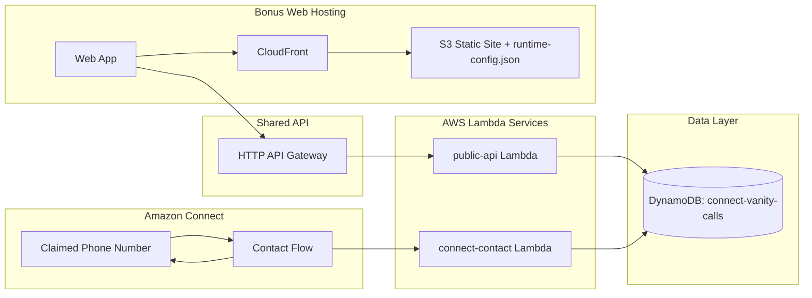

# Architecture Diagram

## Runtime Sequence

1. Caller dials Connect number.
2. Contact flow invokes `connect-contact` Lambda.
3. Lambda generates top vanity options and stores call record in DynamoDB.
4. Flow speaks top 3 vanity options back to caller.
5. Web app reads API URL from `runtime-config.json` and calls API Gateway.
6. `public-api` Lambda returns latest callers from DynamoDB.
